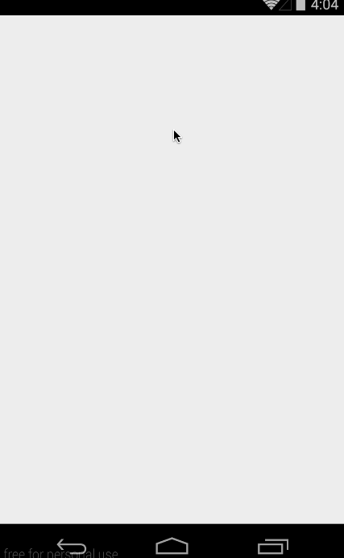

# Simple Twitter Client

This is an Android application that functions with the the Twitter app using the [Twitter API](https://dev.twitter.com/rest/public). See the [Twitter with Fragments guide](http://courses.codepath.com/courses/intro_to_android/week/4#!assignment) for instructions and tips.

Time spent: 15 hours spent in total

Completed user stories:

 * [x] Required: Includes all required user stories from Week 3 Twitter Client
 * [x] Required: User can switch between Timeline and Mention views using tabs.
 * [x] Required: User can view their home timeline tweets.
 * [x] Required: User can view the recent mentions of their username.
 * [x] Required: User can navigate to view their own profile
 * [x] Required: User can see picture, tagline, # of followers, # of following, and tweets on their profile.
 * [x] Required: User can click on the profile image in any tweet to see another user's profile.
 * [x] Required: User can see picture, tagline, # of followers, # of following, and tweets of clicked user.
 * [x] Required: Profile view should include that user's timeline
 * [x] Required: User can infinitely paginate any of these timelines (home, mentions, user) by scrolling to the bottom

Walkthrough of all user stories:

GIF created with [LiceCap](http://www.cockos.com/licecap/).