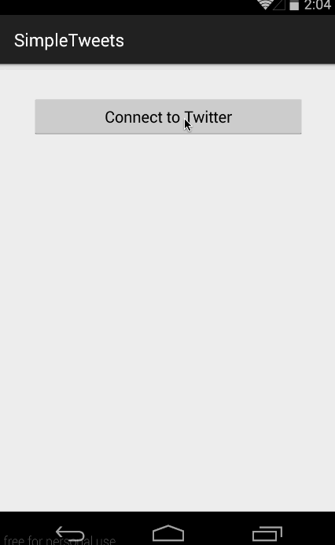

# Simple Twitter Client

This is an Android application that functions with the basics of the Twitter app using the [Twitter API](https://dev.twitter.com/rest/public). See the [Simple Twitter Client guide](http://courses.codepath.com/courses/intro_to_android/week/3#!assignment) for instructions and tips.

Time spent: 15 hours spent in total

Completed user stories:

 * [x] Required: User can sign in to Twitter using OAuth login
 * [x] Required: Displays the username, name, and body for each tweet
 * [x] Required: Displays the relative timestamp for each tweet "8m", "7h"
 * [x] Required: User can view more tweets as they scroll with infinite pagination
 * [x] Required: User can click a "Compose" icon in the Action Bar on the top right
 * [x] Required: User can enter a compose a tweet and post this to twitter, and is then taken back to home timeline with new tweet visible in timeline
 * [x] Optional: Links in tweets are clickable and will launch the web browser
 * [x] Optional: User can see a counter with total number of characters left for tweet
 * [x] Advanced: User can refresh tweets timeline by pulling down to refresh

Walkthrough of all user stories:

GIF created with [LiceCap](http://www.cockos.com/licecap/).